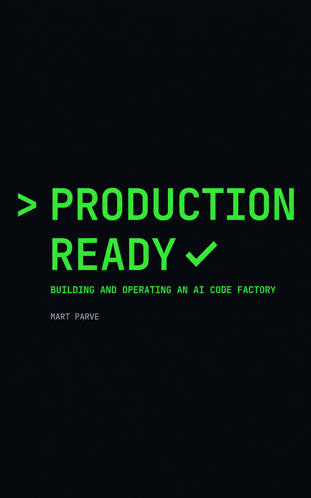

  

<h1 align="center">Production Ready</h1>

  <strong>Building and Operating an AI Code Factory</strong> 
  By Mart Parve

  A systems engineering guide for technical leaders adopting AI-native software development. 
  Covers the full pipeline from business intent to deployed code: specification, agent orchestration, 
  validation, code review, deployment, and the organizational rollout to get there.

---

**[Download EPUB](production-ready.epub)** for Kindle and other e-readers.

## Reading

Start with the [Introduction](chapters/00-introduction.md), then follow the chapter order.

### Part I: The Shift

1. [The Machine That Writes Code](chapters/01-the-machine-that-writes-code.md)
2. [The Anatomy of an AI Code Factory](chapters/02-anatomy-of-an-ai-code-factory.md)
3. [The Context Development Lifecycle](chapters/03-the-context-development-lifecycle.md)
4. [The Tooling Landscape](chapters/04-the-tooling-landscape.md)

### Part II: The Pipeline

5. [Intent Capture](chapters/05-intent-capture.md)
6. [Spec Formalization](chapters/06-spec-formalization.md)
7. [Spec Review and Approval](chapters/07-spec-review.md)
8. [Codebase Onboarding](chapters/08-codebase-onboarding.md)
9. [Branch Sandboxing](chapters/09-branch-sandboxing.md)
10. [Agent Orchestration](chapters/10-agent-orchestration.md)
11. [Validation](chapters/11-validation.md)
12. [Code Review](chapters/12-code-review.md)
13. [Merge, Deploy, and Monitor](chapters/13-merge-deploy-monitor.md)
14. [MCP and the Integration Layer](chapters/14-mcp-integration-layer.md)

### Part III: Running the Factory

15. [Security and Trust](chapters/15-security-and-trust.md)
16. [Cost, Speed, and Token Economics](chapters/16-cost-speed-token-economics.md)
17. [Metrics and Observability](chapters/17-metrics-and-observability.md)
18. [Quality Governance](chapters/18-quality-governance.md)
19. [Case Study: Stripe's Minions](chapters/19-case-study-stripe-minions.md)
20. [The Rollout Roadmap](chapters/20-the-rollout-roadmap.md)
21. [The Evolving Factory](chapters/21-the-evolving-factory.md)

[Bibliography](chapters/22-bibliography.md)

## License

[MIT](LICENSE)
